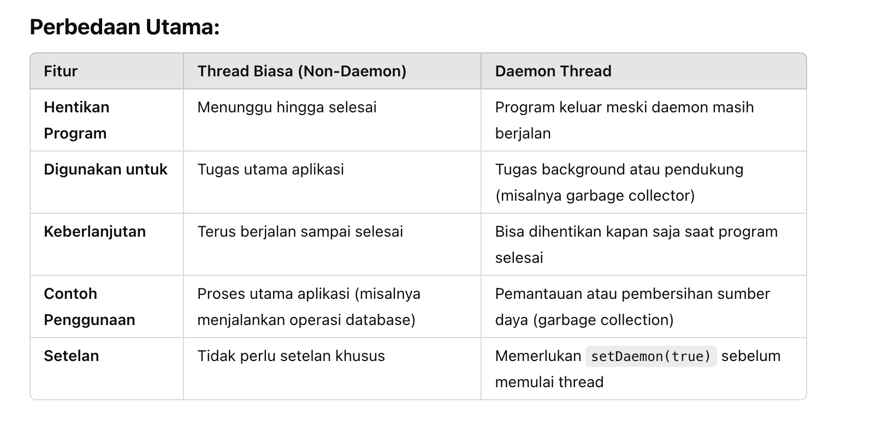

# Thread

## Thread

## Runnable

## Main Thread

## Daemon Thread vs Non Daemon Thread

Daemon Thread : 
- Cocok untuk garbage collection,background process, pemantauan sistem

Non dDaemon Thread :
- Proses bisnis utama & pengolahan data

# Parallel & Concurrency Problem

### Race Condition
1. Race Condition : 
2. Solution synchronized -> method & statemnt
3. synchronized method -> hanya mengizinkan 1 thread yang mengakses suatu method

Meskipun synchronized memastikan bahwa hanya satu thread yang mengakses bagian kode tertentu pada satu waktu, concurrency dan parallelism masih memiliki keuntungan yang signifikan:

Concurrency memungkinkan manajemen tugas secara efisien, terutama ketika ada banyak I/O-bound tasks yang perlu dikelola atau ketika Anda ingin menjaga responsivitas aplikasi.
Parallelism memungkinkan eksekusi tugas yang benar-benar bersamaan, yang sangat berguna untuk CPU-bound tasks yang memerlukan banyak komputasi, seperti pengolahan data besar, rendering grafik, atau komputasi ilmiah.